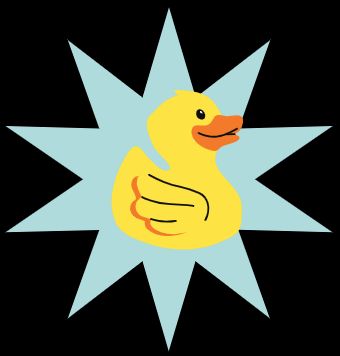
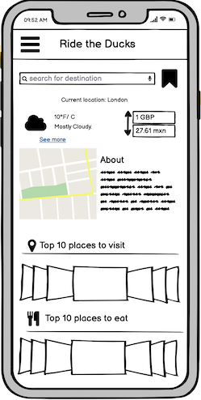
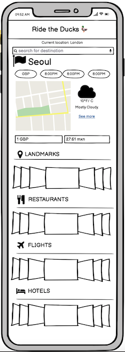

## Ride The Ducks 
### Your all in one traveller app. 


================================= 

## Installation
You can use either the Expo App for mobile or XCode on Mac to view the app.
```
$ git clone https://github.com/RideTheDuck/RideTheDuck.git
$ npm install
```
### Expo App
```
download the Expo App from Google PlayStore or iOs App Store.
$ expo start

On your iPhone or iPad, open the default Apple "Camera" app and scan the QR code you see in the terminal or in Expo Dev Tools.

On your Android device, press "Scan QR Code" on the "Projects" tab of the Expo Go app and scan the QR code you see in the terminal or in Expo Dev Tools.
```
### Expo/XCode
```
Detailed instruction on how to use XCode and Expo on Mac can be found here: 
https://docs.expo.io/workflow/ios-simulator/
```
=================================
## Product Description
An all-in-one traveller app that provides useful information for a selected destination.

## Product Features
* Country information
* Map
* Weather
* Currency converter
* Top things to do
* Top restraunts
* Top hotels
* Flight finder

## Potential Upgrades
* Government travel safety recommendations
* Language translator
* Airline/Hotel ticket wallet

=================================
## User Stories
```
As a user,
So that I can create an account,
I need to be able to create an account.
```
```
As a user,
So that I can log into and out of my account,
I need to be able to log in and out.
```
```
As a user,
So that I can create a new journey,
I need to be able to select a destination.
```
```
As a user,
So that I can visualise where I am looking at,
I want to be able to see a map that displays the current location.
```
```
As a user,
So that I can check what the weather and temperature are,
I want to be able to see information about the weather.
```
```
As a user,
So that I know how much things cost,
I need to be able to check the exchange rate.
```
```
As a user,
So that I know what points of interest there is to visit,
I need to be able to see the top voted attractions.
```
```
As a user,
So that I know where the best places are to eat,
I need to be able to see the top voted restraunts.
```
```
As a user,
So that I know where the best places to stay are,
I need to be able to see the top voted hotels.
```
```
As a user,
So that I know how much flights will cost,
I need to be able to see the cheapest deals for flights.
```
=================================
## Tech Stack 
   

* Database - Firebase 
  * We decided to use Firebase as we wanted to try a different way of storing data than we have already used. Firebase seemed to have easy integration with React Native and was more lightweight than using another database framework (for example PostgreSQL.)
* Front end - React Native 
  * React Native is something the team had not used before. We had some exposure to developing web apps using ReactJS however for mobile development React Native seemed the logical next step in order to try something somewhat new, especially when developing our first mobile application.
* Back end- Node.JS
* Testing - Jest 
  
=================================
### Initial Concept Wireframe
 

### Final Concept Wireframe



### APP Presentation
[Watch the app presentation video](https://github.com/RideTheDuck/RideTheDuck/blob/main/ridetheduckfinalpresentation_cRfG2cxa.mp4)


### Product Presentation

